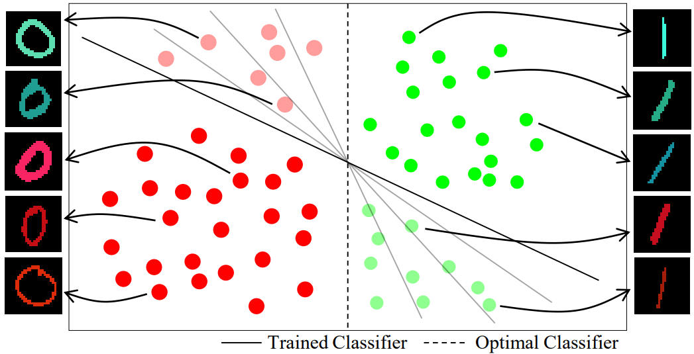
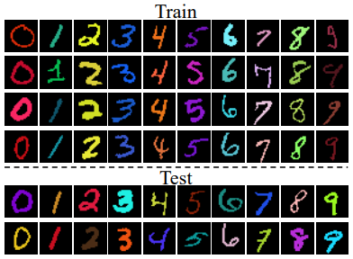

# learning-not-to-learn-tensorflow

This repo is an unofficial TensorFlow implementation of -- [*Learning Not to Learn: 
Training Deep Neural Networks with Biased Data (CVPR 2019)*](https://arxiv.org/abs/1812.10352)  
If you are looking for the official PyTorch source from the authors, redirect to [github.com/feidfoe/learning-not-to-learn](https://github.com/feidfoe/learning-not-to-learn)

## Introduction



This code demonstrates unlearning of bias from an classification model, particularly under a modified version of MNIST dataset named the Colored-MNIST. Here, the training set is artifically injected with bias such that a class category has strong correlation to color, meanwhile the test set is not contaminated with such bias. This effects as false discriminative signal against baseline training methods, and thus results in low test accuracy.  
The authors suggest a novel training method such that the classifier model learns from the training set but *unlearns* from bias. The key ideas are: adoption of a bias prediction model, and a novel regularizing loss function based on mutual information between feature embedding and bias.

## Setup
- Python 3
- TensorFlow 2
- Pillow

## Download Dataset


[Download Colored-MNIST dataset](https://drive.google.com/file/d/1NSv4RCSHjcHois3dXjYw_PaLIoVlLgXu/view?usp=sharing)  
Please refer to the paper for more information on the dataset.  

## Train model
```
python main.py --phase=train\
               --max_epoch=100\
               --batch_size=128\
               --lr=0.001\
               --loss_lambda=0.01
```
To train model by baseline method, add `--train_baseline` argument.  
Once you begin, you can launch TensorBoard on `./logs/` directory to monitor training.
```
tensorboard --logdir=./logs/
```

## Test model
```
python main.py --phase=test\
               --batch_size=128
```

## Reference

- Byungju Kim, Hyunwoo Kim, Kyungsu Kim, Sungjin Kim, Junmo Kim, "Learning Not to Learn: Training Deep Neural Networks with Biased Data", in CVPR, 2019